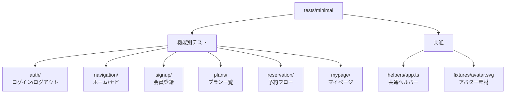

# minimal/ 概要

## 構成図

## 使用している技術

- Playwright（`@playwright/test`）
- TypeScript
- Playwright標準のテストランナー構成（ルートのplaywright設定を使用）
- 画面操作は`getByRole`等のロケーターを中心に記述
- 共通処理は`helpers/app.ts`に集約（URL・ログイン・入力補助など）

## テスト設計の特徴

- BDD/生成コードは使わず、**Playwrightのデフォルト機能のみ**でシンプルに実装
- 重要な業務フロー（ナビ、ログイン、会員登録、プラン、予約、マイページ）は網羅されている
- データ駆動は最小限（固定ユーザーの利用が中心）

## 実行・成果物

- ベースURL: `http://127.0.0.1:8080/ja`
- 実行コマンド: `npm run test:minimal`
- レポート/成果物: HTMLレポート（`playwright-report/`）、スクリーンショット/動画/トレース
