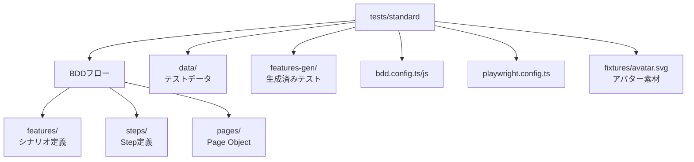

# standard/ 概要

## 構成図

## 使用している技術

- Playwright（`@playwright/test`）
- TypeScript
- playwright-bdd（Gherkin/BDD）
- Page Object Model（`pages/`）
- データ駆動（`data/`）
- 生成フロー（`bddgen`で`features-gen/`を生成）
- ビジュアルリグレッション（スナップショットを前提）

## テスト設計の特徴

- **Gherkin → Step定義 → Page Object**の3層構造
- ハッピーパス/エラーパスに加え、アクセシビリティ・セキュリティ・ビジュアル検証を強化
- 画面遷移と入力の再利用性を高めた構成
- `tests/standard/playwright.config.ts`で標準環境向け設定を分離

## 実行・成果物

- ベースURL: `http://127.0.0.1:8080/ja`
- 生成: `npm run bddgen:standard`（`features-gen/`を作成）
- 実行コマンド: `npm run test:standard` / `npm run test:standard:all`
- ビジュアル更新: `npm run test:standard:vr`
- レポート/成果物: HTMLレポート（`playwright-report/`）、スクリーンショット/動画/トレース
